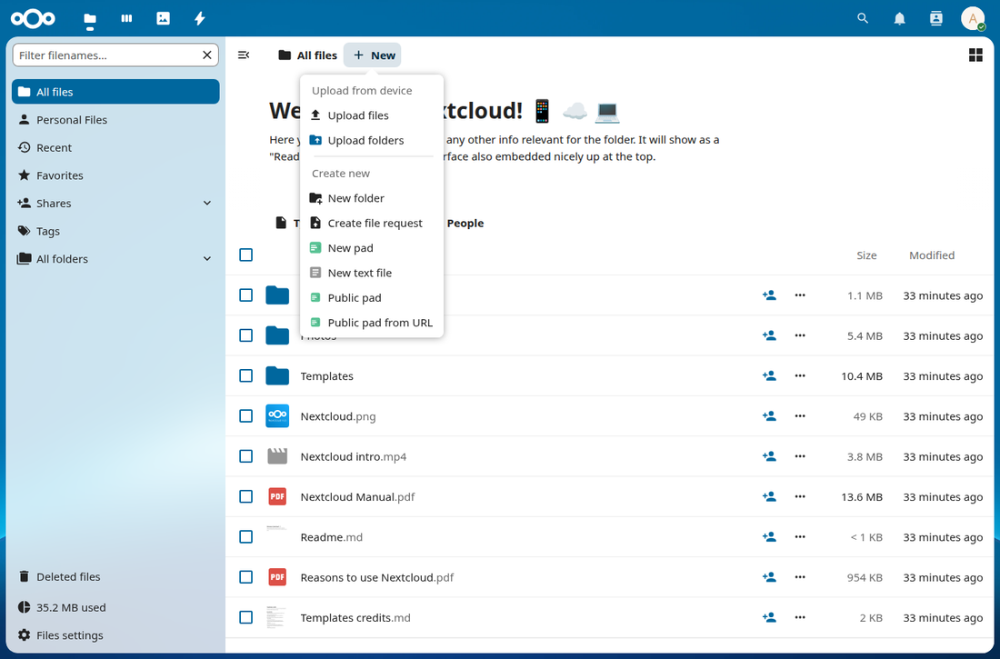
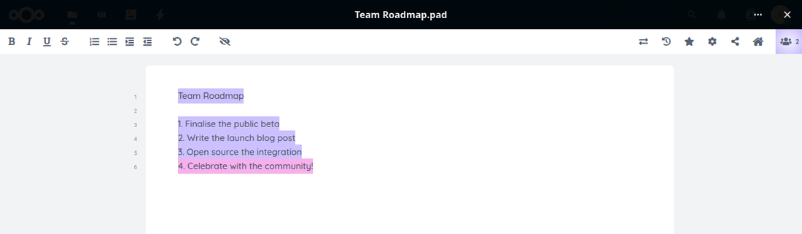
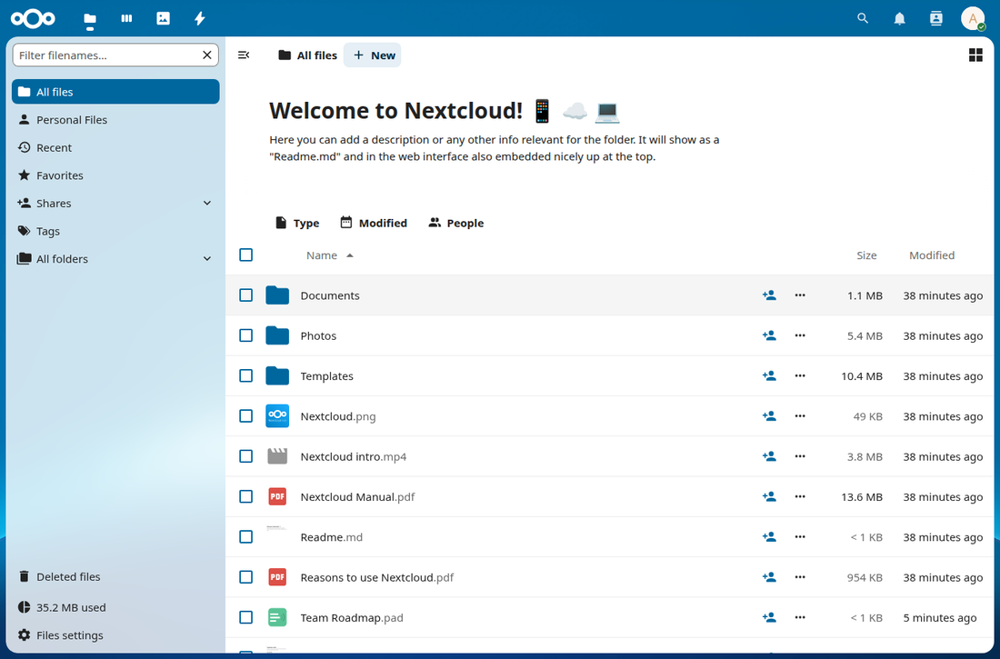

# Etherpad Integration for Nextcloud

This plugin lets you surface pads from an Etherpad instance inside Nextcloud and organize them there like other files.

## Core Features

- Each Etherpad pad is represented by a `.pad` file inside Nextcloud
- `.pad` files live in normal Nextcloud folders and integrate with sharing, trash, restore, and file organization
- Opening a `.pad` file in Nextcloud opens the linked Etherpad pad inside the native Nextcloud file viewer in an iframe
- Protected and public pad modes
- Public folder/file share support for `.pad`
- Periodic sync from Etherpad into `.pad` snapshots
- Trash deletes on Etherpad (with deferred retry when Etherpad is temporarily unavailable)
- Restore recreates pads from `.pad` snapshot data

## Screenshots

Create a pad straight from the Files app with `+ New`:



Open a `.pad` file and the linked Etherpad pad loads in the native Nextcloud viewer, with real-time collaboration and per-author colours:



Pads live alongside your other files and behave like any other Nextcloud file:



## Requirements

- Nextcloud `30` to `33` (see [appinfo/info.xml](appinfo/info.xml))
- Etherpad reachable from Nextcloud server
- Etherpad API key
- HTTPS for production deployments
- For protected pads in the embedded viewer: Nextcloud and Etherpad must allow iframe embedding and send compatible cookies.
- Recommended: run Nextcloud and Etherpad on the same registrable domain, for example `cloud.example.org` + `pad.example.org`.

## Etherpad Compatibility

- Works with different Etherpad releases via API version detection (fallback supported).
- This plugin requires Etherpad API key mode (`authenticationMethod: "apikey"`).
- OAuth-only Etherpad setups are not supported by this plugin.

## Ownpad Compatibility

- Running this app and Ownpad at the same time is not supported.
  - Both apps hook into `.pad` MIME/viewer handling, which leads to ambiguous file-type resolution and open-action conflicts.
- Legacy Ownpad `.pad` files (`[InternetShortcut]` + `URL=...`) are automatically migrated to this app's binding-and-`.pad` model the first time a user opens them. The migration branches on the source URL's origin and the embedded pad-id:
  - Same Etherpad server, free-form pad-id → re-bound as a managed public pad.
  - Same Etherpad server, group pad-id (`g.<group>$<name>`) → re-bound as a managed protected pad.
  - Different Etherpad server → converted to an external (`ext.*`) public pad pointing at the original URL.
- If two Ownpad `.pad` files point at the same pad, only the first one to be opened gets the binding; the second is treated like a copied pad (no second binding row, the existing copy-of-a-pad flow handles open from there). See [`docs/legacy-ownpad-migration.md`](docs/legacy-ownpad-migration.md) for the full state table, audit-log shape, and the security rationale.

## Install

The repository contains Vite-built frontend assets in `js/`. If you change
files in `src/`, rebuild before copying the app:

```bash
npm install
npm run build
```

### 1) Copy app into Nextcloud

Place this repository as:

`<nextcloud-root>/apps/etherpad_nextcloud`

### 2) Enable app

```bash
php occ app:enable etherpad_nextcloud
```

### 3) (If needed) rebuild mimetype caches

Run this if `.pad` icons/actions do not appear correctly after install/upgrade:

```bash
php occ maintenance:mimetype:update-js
php occ maintenance:mimetype:update-db
```

### 4) Open admin settings

Go to:

`Settings -> Administration -> Pads`

and configure:

- Etherpad Base URL
- Etherpad API URL (optional; defaults to Base URL)
- Etherpad API key (OAuth is not required; Etherpad API key auth is used)
- Copy content to `.pad` file interval
- Which pad types users may create (see below)
- Delete-on-trash policy
- External public pad policy

Two settings control which pad types the app offers, both enabled by default:

- **Protected pads** — only people who can open the `.pad` file in Nextcloud
  can open the pad. Created as Etherpad group pads, which require a session
  issued by Nextcloud.
- **Public pads** — anyone with the pad link can open the pad, without a
  Nextcloud account.

Switching a type off hides its `+ New` entries and refuses new pads of that
type on the API create endpoints. Pads that already exist keep working either
way.

Two paths fall back rather than refuse, so nothing gets stranded: a template
carrying the disabled mode, and the first-open initialisation of a `.pad`
that arrived outside the app (over WebDAV, say). Both create the pad in the
enabled mode; only with both types off is creation refused outright. Note
that this can widen access — a protected template becomes a public pad when
protected pads are off.

The setting decides what the app offers; it is not a hard boundary against a
user who crafts `.pad` files by hand. Recovering an orphaned `.pad` from its
snapshot still re-provisions the mode recorded in that file, because rescuing
existing content takes precedence.

Linking external public pads is governed separately by the external pad
policy and is unaffected by these two settings.

### 5) Check iframe and cookie setup for protected pads

If protected pads should open inside the Nextcloud viewer iframe:

- Etherpad responses must allow embedding from your Nextcloud origin.
- Reverse proxies must not enforce a conflicting `X-Frame-Options` policy.
- A `Content-Security-Policy: frame-ancestors ...` header on the Etherpad side is the most reliable modern setup.
Protected pads additionally require Nextcloud and Etherpad to **share a parent
domain**, unless both run on the same host. Nextcloud issues the Etherpad
session cookie from its own response, and a browser only accepts a `Domain=`
that covers the host which sent it. A response from `cloud.example.org` can
therefore never set a cookie that reaches `pad.otherdomain.example`, and
`SameSite=None` does not change that — it governs whether an already valid
cookie is sent cross-site, not which domain may be set.

- Same host for both: nothing to configure, a host-only cookie covers it.
- Shared parent domain: the cookie domain is derived automatically, and
  Etherpad's default `SameSite: Lax` usually works.
- Unrelated registrable domains: protected pads cannot work with the current
  session model. Move one host, or switch protected pads off and offer public
  pads instead.

Example:

- `cloud.example.org` + `pad.example.org` -> works, cookie domain `.example.org`
- `cloud.example.org` + `cloud.example.org` -> works, host-only cookie
- `cloud.example.org` + `pad.otherdomain.example` -> not supported for protected pads

`Test Etherpad connection` reports this alongside the connection result, and the
settings page shows it without running the test.

## Upgrade

1. Replace app files in `apps/etherpad_nextcloud`
2. Run:

```bash
php occ app:disable etherpad_nextcloud
php occ app:enable etherpad_nextcloud
php occ maintenance:mimetype:update-js
php occ maintenance:mimetype:update-db
```

For deployment, copy the app to `apps/etherpad_nextcloud` and exclude development-only content such as `.git/`, `node_modules/`, `tests/`, `docs/`, `.phpunit.cache/`, and local temp files. Keep the built `js/` assets in the deployed app.

## Development Checks

Frontend source lives in `src/` and is built into `js/` with Vite.

```bash
npm test
npm run build
```

PHP checks and optional E2E checks are described in [docs/release-process.md](docs/release-process.md).

## Usage

### Create pads

- `+ New -> New pad`
- `+ New -> Public pad` (internal public pad on the configured Etherpad instance, or external public pad by URL)

### Open pads

- Click `.pad` file in Files app
- App uses Nextcloud native viewer flow (`openfile=true`)

### Sync

- One-way sync only: content is copied from Etherpad into the `.pad` file snapshot.
- No automatic reverse sync from `.pad` file content back into Etherpad.
- Automatic while viewer is open (interval from admin settings) and on viewer hide / page unload.
- Backend endpoint `POST /api/v1/pads/sync/{fileId}` remains available for programmatic syncs.

### Trash/Restore

- When a `.pad` file is moved to the Nextcloud trash, the linked Etherpad pad is deleted.
- If Etherpad is temporarily unavailable, delete is deferred and retried.
- When the `.pad` file is restored from the Nextcloud trash, a new pad is recreated and the snapshot from the `.pad` file is replayed.

## Troubleshooting

### `.pad` downloads instead of opening in viewer

- Ensure app is enabled:
  - `php occ app:list | grep etherpad_nextcloud`
- Rebuild mimetype caches:
  - `php occ maintenance:mimetype:update-js`
  - `php occ maintenance:mimetype:update-db`
- Reload browser with hard refresh

### Wrong `.pad` icon (fallback/red icon)

- Re-run mimetype update commands above
- Check that app CSS loads
- Confirm app migration alias is applied (app re-enable usually handles this)

### `+ New` entries missing

- Hard refresh browser once
- Confirm Files app JS loaded without fatal errors in browser console

### Protected pad permission errors

- Verify Etherpad API key and Etherpad auth mode
- Run admin `Test Etherpad connection` in `Settings -> Administration -> Pads`

### Protected pads fail because of cookies / iframe auth

- First check the domain relationship: Nextcloud and Etherpad must share a
  parent domain, or run on the same host. `Test Etherpad connection` names both
  hostnames when they do not.
- Check Etherpad cookie settings:
  - shared parent domain: default `SameSite: "Lax"` is usually enough
  - across subdomains behind a proxy: `cookie.sameSite: "None"` and `trustProxy: true`
- HTTPS is required when using `SameSite=None`
- A shared parent that is a public suffix (`co.uk`, `github.io`) does not count:
  browsers reject it as a cookie domain

### Etherpad is blocked inside the Nextcloud viewer iframe

- Check response headers on the Etherpad side and in the reverse proxy
- Remove or relax conflicting `X-Frame-Options` rules
- Prefer a `Content-Security-Policy: frame-ancestors 'self' https://your-nextcloud.example` header that explicitly allows your Nextcloud origin

### iPhone / iOS Safari zooms when focusing the embedded editor

- Usually caused by small editor/form font sizes inside Etherpad, not by the outer Nextcloud shell
- For the default `colibris` skin, adjust `src/static/skins/colibris/pad.css`, for example in the mobile `@media (max-width: 768px)` section, and raise the effective pad/editor font size from `15px` to `16px`
- Test in a private Safari tab or after clearing website data because Etherpad CSS is cached aggressively

## Documentation

- Architecture: [docs/architecture.md](docs/architecture.md)
- API routes: [docs/api-reference.md](docs/api-reference.md)
- Etherpad integration details: [docs/etherpad-integration.md](docs/etherpad-integration.md)
- `.pad` format: [docs/pad-format.md](docs/pad-format.md)
- I18N: [docs/i18n.md](docs/i18n.md)
- UI icons: [docs/ui-icons.md](docs/ui-icons.md)
- Testing and release checks: [docs/release-process.md](docs/release-process.md)

## License

- App code: AGPL-3.0-or-later (full text: [LICENSES/AGPL-3.0.txt](LICENSES/AGPL-3.0.txt))
- Etherpad logo assets in `img/etherpad-icon-*.svg`: Apache-2.0 (full text: [LICENSES/Apache-2.0.txt](LICENSES/Apache-2.0.txt))

## Acknowledgements

- Thanks to the Ownpad project for the groundwork, ideas, and lessons learned that inspired and shaped this plugin.
